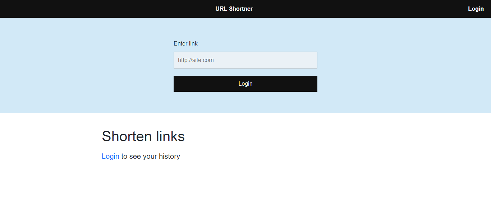
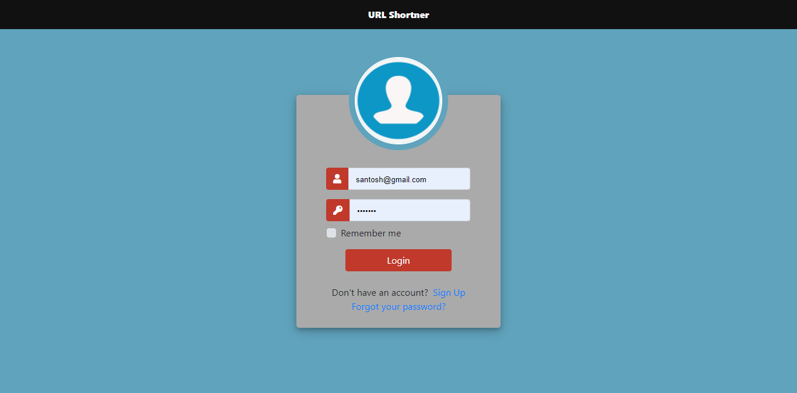
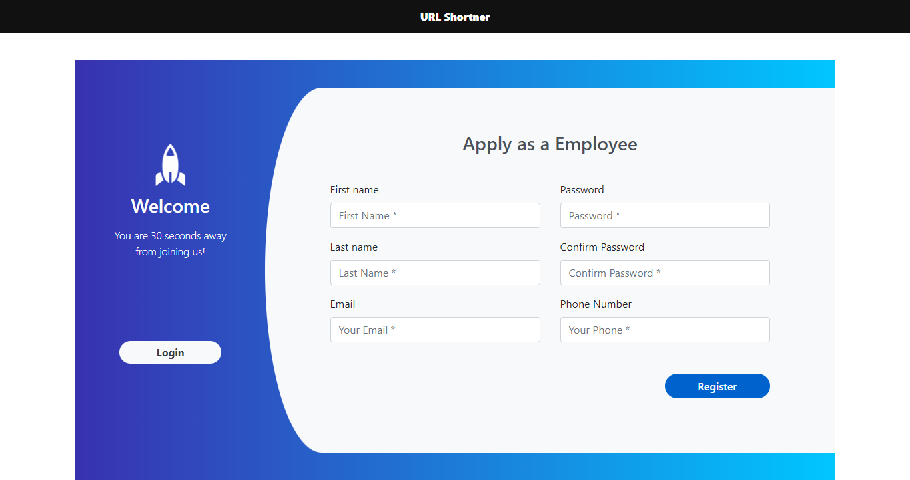
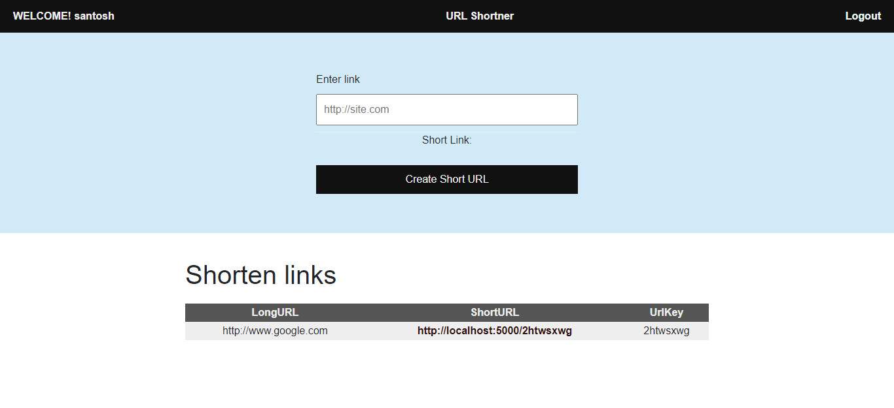
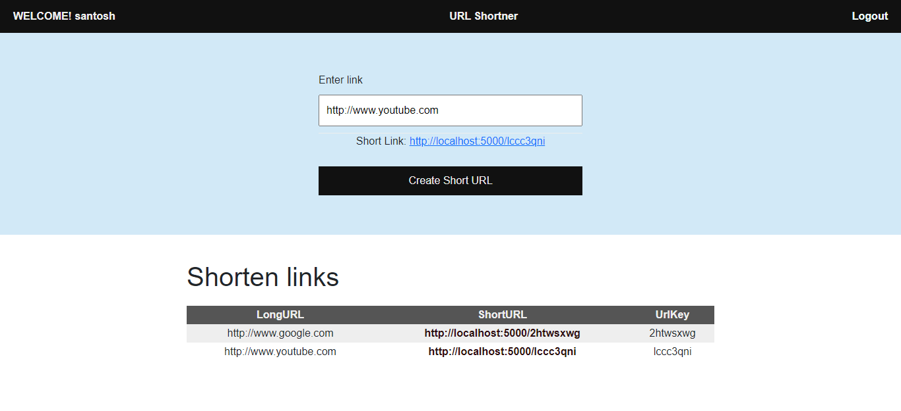

# Url shortner using nodejs
‘Url shortner’ is a web-based application where user can shorten long urls.

## Developed using 
> Languages: 
  > 1. HTML
  > 2. CSS
  > 3. JAVASCRIPT 
 
> Framework: 
  > 1. Node.js 
   >> Express js

> Database: 
  > 1. MySQL 
 
## Features
* Login
* Signup
* Users url history
 

## Preview
* Default page of the web app
 &nbsp;
***
* Login if you are old user to shorten the original url.
 &nbsp;
***
* Regsiter if you are new user.
 &nbsp;
***
* Insert your url.
 &nbsp;
***
* Output (Short url) for your original url.
 &nbsp;

